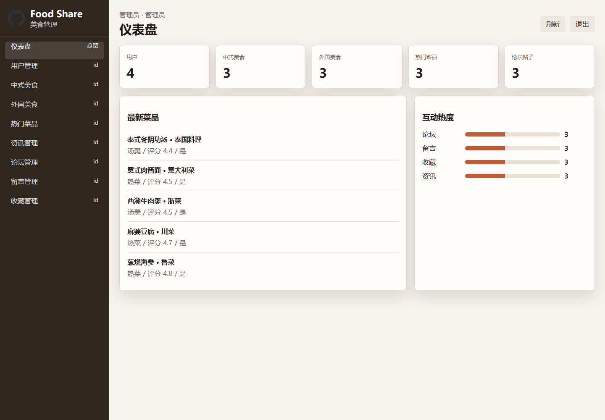
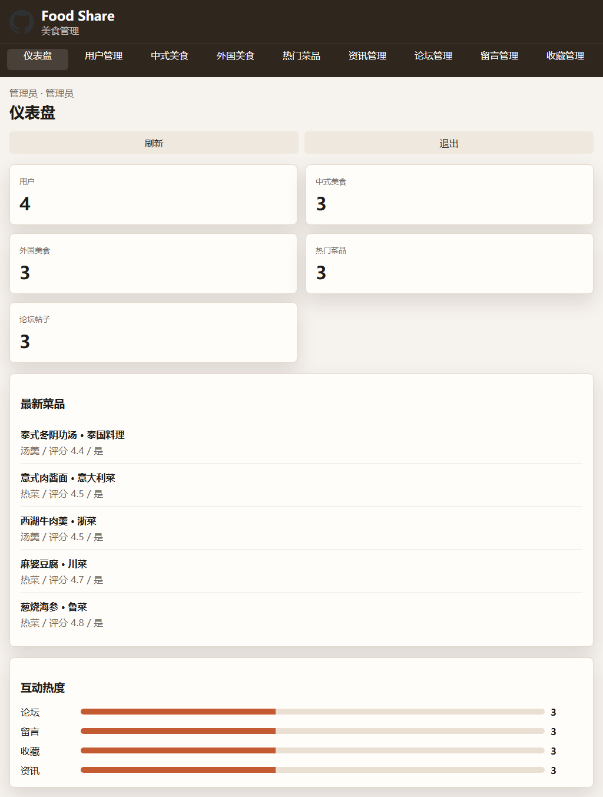

# 美食交流与菜品分享平台

美食交流与菜品分享平台是一个围绕中式美食、外国美食、热门菜品、资讯、论坛和留言互动的作品集演示项目。

[](https://ot-springbooth10zf.pages.dev)


## 在线演示

| 项目 | 地址 |
|---|---|
| GitHub 仓库 | https://github.com/Nemo-netone/ot-springbooth10zf |
| 演示地址 | https://ot-springbooth10zf.pages.dev |
| 生产分支 | `main` |
| Cloudflare Pages | `ot-springbooth10zf` |
| Cloudflare Worker | `ot-springbooth10zf-api` |
| Supabase schema | `ot_springbooth10zf` |

## 演示账号

| 角色 | 账号 | 密码 | 用途 |
|---|---|---|---|
| 管理员 | `abo` | `abo` | 查看仪表盘和所有管理模块 |
| 普通用户 | `11` | `11` | 演示用户视角和内容互动数据 |

这些账号仅用于公开演示。不要录入真实手机号、真实姓名或敏感业务数据。

## 截图

| 首页登录 | 管理后台 | 移动端 |
|---|---|---|
|  |  |  |

## 功能范围

- 用户管理：平台注册用户、联系方式、个人资料维护。
- 中式美食：菜品名称、菜系、材料、做法、评分、审核状态维护。
- 外国美食：外国菜品分类、材料、做法、来源和审核管理。
- 热门菜品：热门菜品内容、发布日期、点赞和点踩数据。
- 资讯管理：平台资讯标题、简介和正文维护。
- 论坛管理：用户交流帖子、发帖人和开放状态。
- 留言管理：留言内容、管理员回复和留言人。
- 收藏管理：用户收藏的菜品、资讯和论坛内容。

详细功能树见 [docs/features.md](docs/features.md)，演示账号见 [docs/accounts.md](docs/accounts.md)。

## 技术结构

当前仓库保留原 Spring Boot 项目资料，同时新增适合线上访问的演示部署层：

| 层级 | 当前线上实现 | 说明 |
|---|---|---|
| 前端 | `site/` 静态 SPA | Cloudflare Pages 托管 |
| API | `site/_worker.js` 与 `worker/src/index.js` | Worker 兼容接口 |
| 数据库 | `supabase/schema.sql` | `ot_springbooth10zf` 独立 schema |
| 原项目资料 | `src/`、`db/`、`pom.xml` | Spring Boot、MyBatis Plus、MySQL、Shiro |

线上调用链：

```text
浏览器
  -> Cloudflare Pages: site/index.html, site/app.js, site/styles.css
  -> Pages Functions / Worker: /api/*
  -> Supabase RPC: public.ot_springbooth10zf_rest
  -> Supabase schema: ot_springbooth10zf
```

## 本地运行

只预览线上 API 版前端：

```powershell
python -m http.server 4173 -d site
```

访问：

```text
http://localhost:4173
```

本地调试 Worker：

```powershell
npx wrangler pages dev site
```

## Original frontend recovery (2026-07-12)

- Production directory: `original-site/`; legacy `site/` remains fallback only.
- Source basis: original public frontend under `src/main/resources/front/front` and Vue admin under `src/main/resources/admin/admin`.
- Online compatibility: Pages Worker uses schema `ot_springbooth10zf`; admin/user login, news list, and news create/update/delete were verified.
- Stable URL: `https://ot-springbooth10zf.pages.dev`.

## 环境变量

Cloudflare Pages / Worker 需要配置：

```text
SUPABASE_URL=<supabase-url>
SUPABASE_SERVICE_ROLE_KEY=<supabase-service-role-key>
SUPABASE_SCHEMA=ot_springbooth10zf
CORS_ALLOWED_ORIGINS=https://ot-springbooth10zf.pages.dev
```

真实密钥只能放在 Cloudflare secrets 或本地受控环境里，不能写入仓库。

## 部署说明

部署事实、命令、验证记录和限制见 [docs/deployment.md](docs/deployment.md)。后续发布继续使用：

- GitHub 仓库：`ot-springbooth10zf`
- Cloudflare Pages 项目：`ot-springbooth10zf`
- 生产分支：`main`
- 稳定地址：`https://ot-springbooth10zf.pages.dev`

## 已知限制

- 线上演示使用 Cloudflare Worker API 兼容层，不直接运行原 Spring Boot 后端。
- 当前数据为演示种子数据，适合作品集展示，不作为生产系统使用。
- 当前权限以公开演示账号区分，不实现完整生产级鉴权、审计和文件上传存储。

## 许可证

本项目使用 PolyForm Noncommercial License 1.0.0。允许非商业学习、演示和修改；商业使用需要获得作者额外授权。
